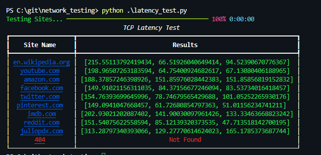

# Network Latency Testing

This is just a simple script that will use the [TCP Latency](https://github.com/dgzlopes/tcp-latency) python package. You can modify the list fo websites to hit and the amount of attempts per site. Thank you to the authors of Rich and tcp-latency

## Getting started

### Installations

- `pip3 install rich`
- `pip3 install tcp-latency`

### Run script

Here is an example of the output. I added a progress bar and pretty output because... why not? I hope you enjoy and best of luck!

